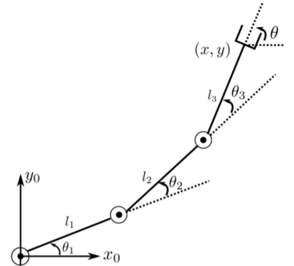
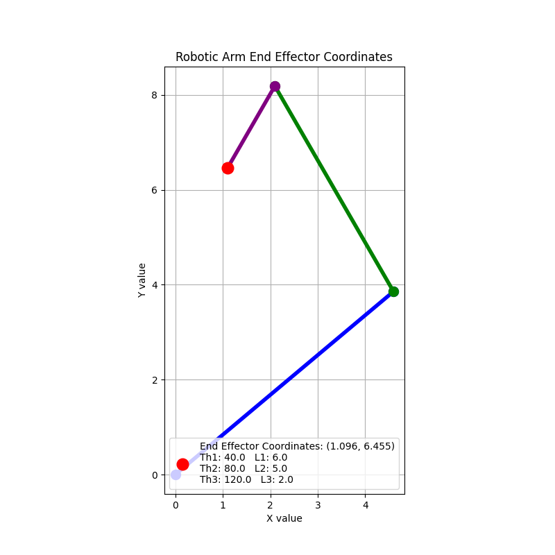

# CS369 Lab 2: Forward and Inverse Kinematics

## Overview
The goals of this lab:
- Understand and apply the mathematical models behind forward kinematics in 2 and 3 dimensions.
- Practice working with homogeneous transformation matrices.
- Visualize the outputs of forward kinematics.
- Understand and apply the math behind inverse kinematics in 2 dimensions.

*Credit: Based on materials created by Owen Bluman, Zenas Boamah, Matt Feinstein, and Lei Lei.*

## Introduction
As discussed in lecture, a robot can be represented as a series of joints and links. For this lab, we will consider a three-link robot with link lengths: $\ell_{1}, \ell_{2}, \ell_{3}$, whose configuration is denoted by each joint's rotation angle: $\theta_{1}, \theta_{2}, \theta_{3}$. Note that the angles are measured relative to the direction of the previous link, with the first link's angle being measured relative to its initial position. We assume our robot starts out aligned with the x-axis of the world frame, with the robot's first joint at the world frame's origin, and its end effector at the end of the third link. Below is an example visualization of our robot in 2D.

   
  <b>Figure 1:</b> Three-link robot   <i>(Howie Choset, CMU)</i>

You will implement forward kinematics functions to calculate the robot's end effector position from its joint configuration, as well as accompanying visualization functions in 2D and 3D. You will also implement an inverse kinematics function to calculate the joint configuration(s) that will result in the end effector being at a given goal position in 2D. Your functions should be implemented within the provided `Robot` class.

## Part 1: Forward Kinematics in 2D
Recall the rotation and translation matrices in 2D:

$$R(\theta) = \begin{bmatrix}
\cos(\theta) & -\sin(\theta) \\
\sin(\theta) & \cos(\theta)
\end{bmatrix}$$

$$p = \begin{bmatrix}
P_x \\
P_y
\end{bmatrix}$$

Implement a `forward_kinematics_2d()` function that calculates and returns as a tuple the end effector's $(x, y)$ coordinates with respect to the world frame, given the robot configuration. You may only use matrix multiplications in your calculation. This can be achieved by representing the frame transformations as homogeneous transformation matrices. Make sure to add comments explaining the transformations each matrix is representing in your code. You are encouraged to use `numpy` for the calculations.

### Visualization
Using a visualization library that you are most familiar with (e.g., `matplotlib`, `pygame`), create a function to visualize the robot's links, joints, and end effector. See the below example for inspiration:

  

## Part 2: Forward Kinematics in 3D
Rotation in 3-dimensional space can be thought of as a sequence of rotations around the $x, y,$ and  $z$ axes. The following matrices represent rotations about the respective axes:

$$R_{x}(\theta) = \begin{bmatrix}
1 & 0 & 0 \\
0 & \cos(\theta) & -\sin(\theta) \\
0 & \sin(\theta) & \cos(\theta)
\end{bmatrix}$$

$$R_{y}(\phi) = \begin{bmatrix}
\cos(\phi) & 0 & \sin(\phi) \\
0 & 1 & 0 \\
-\sin(\phi) & 0 & \cos(\phi)
\end{bmatrix}$$

$$R_{z}(\gamma) = \begin{bmatrix}
\cos(\gamma) & -\sin(\gamma) & 0 \\
\sin(\gamma) & \cos(\gamma) & 0 \\
0 & 0 & 1
\end{bmatrix}$$

To combine the rotations, we decide on an order to the sequence and multiply the matrices together, such as: $R=R_xR_yR_z$.

We assume our three-link robot has revolute joints, meaning each joint can only rotate about one axis. Each joint's rotation can thus be characterized by a single angle, and its rotations about the other axes are represented by the identity matrix. Our robot's first joint rotates about the z-axis, and its remaining two joints rotate about the y-axis.

Similar to part 1, implement a `forward_kinematics_3d()` function that uses homogeneous transformation matrices to calculate and return as a tuple the 3D coordinates $(x, y, z)$ of the end effector with respect to the world frame, given the robot configuration. 

### Visualization
Create a function to visualize the robot's links, joints, and end effector. See the below example for inspiration:

  

## Part 3: Inverse Kinematics
Implement an `inverse_kinematics_2d(x,y,theta)` function that returns a list of lists, representing the joint configurations (in degrees) for the end effector to be at the given $(x,y)$ position and rotated by $\theta$ (in degrees) with respect to the world frame (as shown in Figure 1). The output should be an empty list if a solution does not exist. Note that the robot's link lengths are known and $\theta_{1}+\theta_{2}+\theta_{3}=\theta$.

**Hint**: Try to reduce this to an inverse kinematics problem for a two-link robot, then implement the known solution for that. Your forward kinematics function can also be used to check your inverse kinematics solution.

## Deliverables
- Well-commented forward kinematics, visualization, and inverse kinematics functions.
- Visualizations of the robot in 2D and 3D (at least one figure for each case). Make sure to record the corresponding robot's link lengths and joint angles.
- Test cases for your forward and inverse kinematics functions.
- Answers for the README questions.