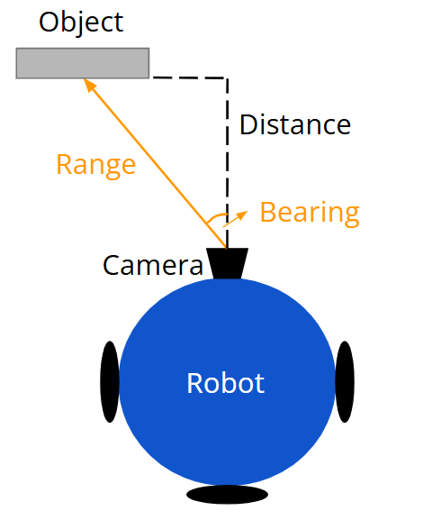

# CS369 Lab 6: Localization

## Overview
The goals of this lab:
- Create a pipeline to enable the robot to take in environment information to inform itself about its position.
- Implement a probabilistic method to determine the robot's most likely position on a known map.

*Credit: Based on materials created by Howie Choset (CMU).*

## Part 1: Sensor Measurements
Extend your distance estimation pipeline from lab 5 to take in images of known objects and determine the object's range (in meters) and bearing (in radians) relative to the robot's local coordinate frame.

Figure 1 below illustrates the object's range and bearing relative to the camera, where the range is the distance from the camera's center to the object's center, and the bearing is the object's rotation relative to the camera's heading direction. Note that we define counterclockwise rotation as positive, and the camera's coordinate frame is usually different from the robot's frame.

   
  <b>Figure 1:</b> Object's range and bearing relative to the camera's coordinate frame  

Include in your code an explanation of the steps in your pipeline and the reasoning behind them (with at least three symbolic equations). Your pipeline should also output a numerical signature for the object.

## Part 2: Localization
Localization is the process of determining the robot's pose relative to the environment map. For this lab, you will implement the Monte Carlo localization algorithm to determine the robot's location along a circular path. 

   
  <b>Figure 2:</b> Example environment configuration  

Your robot must travel counterclockwise along the circular path. You may use your line-following code from lab 5.

You should implement the velocity-based motion model and feature-based sensor model (with known correspondence) for localization. You will need to tune the algorithms' parameters to improve localization performance. Note that the robot's heading direction should be constrained by its location on the circular path.

### Demo Instructions
- Your robot will be placed on the path at a predetermined start position (unknown to the robot).
- Your robot will be given the environment map and should determine its location on the map within 120 seconds.
- Figure 2 shows an example environment configuration. For the demo, the landmarks will be the same but their locations will be different.
- You must output probabilistic locations during the localization process, while keeping the terminal output fairly clean. Consider printing the robot's highest probability location, along with your calculated probability of it being at that location.
- We will use the center of the robot's base as the reference position to determine your robot's final location for grading purposes.

## Deliverables
- Demonstrate and get checked off for the localization portion during lab on April 1.
- Well-commented functions.
- Test cases for your sensor measurements.
- Answers for the README questions.

